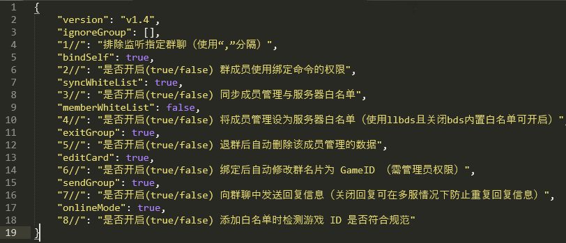

# BetterWhitelist（更好的白名单）

|   **作者**   | 9Yan                  |
| :----------: | :-------------------- |
|   **介绍**   | 更完善的白名单方案    |
| **更新日期** | 2023.2.3 v1.3         |
|   **下载**   | [历史版本](#历史版本) |

> [!WARNING] 此插件最低支持版本为 Serein `v1.3.3`  
> 在 `v1.3.3` 及以前版本 解绑 返回值有误，可以解绑但不会显示返回值  
> 低版本可能存在未知 bug

## 功能

- 手动、自动**同步 Serein 的成员管理 与 服务器白名单**（关服时也能绑定，可选择是否开启）
- 群成员使用群命令 **绑定/解绑自己的成员管理**（可选择是否开启）
- Serein 管理权限列表的管理使用群命令 **绑定/解绑其他人的成员管理**
- **将 Serein 成员管理设为服务器白名单**（使用 llbds 且关闭 bds 内置白名单可开启）
- 退群后自动删除该成员管理的数据（可选择是否开启）
- 绑定后自动修改群名片为 XboxID （需管理员权限，可选择是否开启）
- 排除监听指定群聊，可以单独开个服务器玩家群用于管理玩家
- 监测服务器启动自动同步白名单，关服也能增删白名单

## 使用方法

- 群成员发送：`绑定 xboxID`
- 使自己 QQ 与该游戏 id 绑定，并获得白名单（可选择是否开启）
- 相同关键词：bind（大小写随意)
- 群成员发送：`解绑`
- 使自己 QQ 与已绑定游戏 id 解绑，并删除白名单（可选择是否开启）
- 相同关键词：unbind（大小写随意）

- 管理员发送：`添加白名单 QQ 号(@成员) xboxID`
- 使该 QQ 与游戏 id 绑定，并获得白名单
- 相同关键词：wladd、whitelistadd（大小写随意）
- 管理员发送：`删除白名单 QQ 号(@成员) xboxID`
- 使该 QQ 与游戏 id 绑定，并获得白名单
- 相同关键词：wldel、whitelistdelete（大小写随意）

- 管理员发送：`白名单列表`
- 列出 Serein 成员管理列表，并显示是否添加服务器白名单
- 相同关键词：wllist、whitelist（大小写随意）

  

- 管理员发送：`同步白名单`
- 以 Serein 成员管理为准，自动添加/删除服务器白名单。
- 相同关键词：syncwl、syncwhitelist（大小写随意）

## 特征

- 完善的白名单增删逻辑

- 各种防呆设计

## 配置文件

- 3 与 4 选一个开即可

## 历史版本

- 2023.2.3 [1.3](https://download.serein.cc/https://raw.githubusercontent.com/Zaitonn/Serein-Docs/publish/JS/BetterWhitelist/1.3/BetterWhitelist.js)
