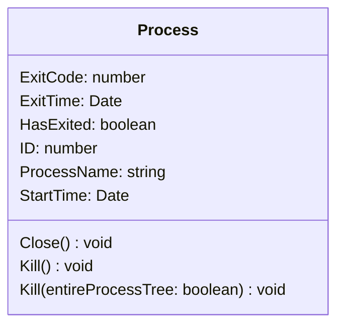
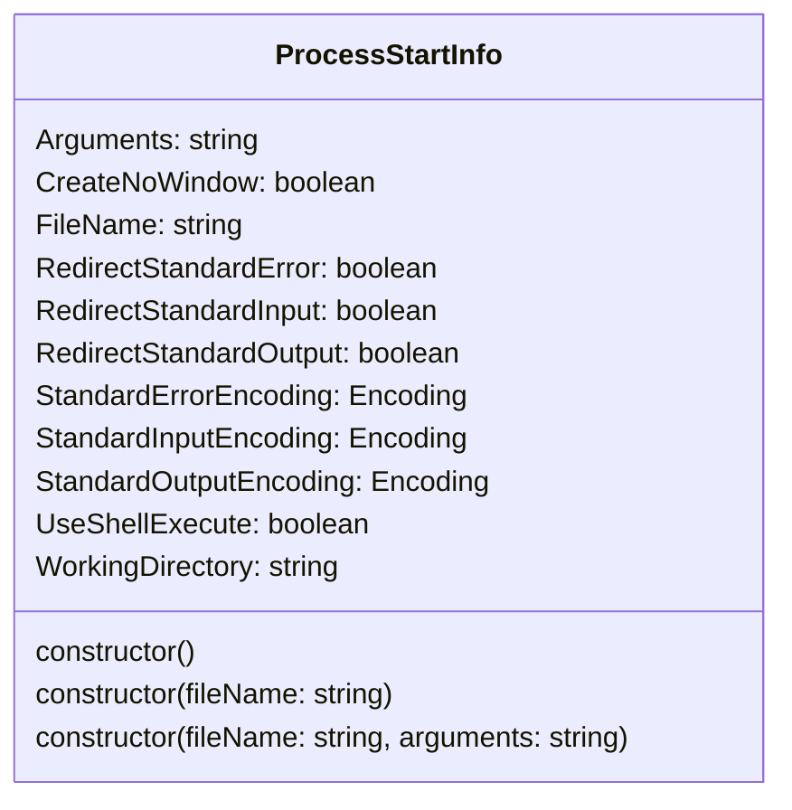

# 🌰 System.Diagnostics

提供允许你与系统进程、事件日志和性能计数器进行交互的类

:::tip

- 此章节中默认已导入以下命名空间
  ```js
  const {
    Diagnostics: {
      Process,
      ProcessStartInfo
    },
    Text: {
      Encoding
    } } = System;
  ```
- 使用`Process`和`ProcessStartInfo`前需要在[预加载配置](../preLoadConfig)中导入`System`命名空间

:::

>参考 [System.Diagnostics 命名空间](https://learn.microsoft.com/zh-cn/dotnet/api/system.diagnostics)

## `Process`类



### 主要属性

- `ExitCode: number` 关联进程终止时指定的代码
  - 进程尚未退出时获取将导致报错
- `ExitTime: Date` 关联进程退出的时间
- `HasExited: boolean` 关联进程是否已终止
- `ID: number` 关联进程的唯一标识符
- `ProcessName: string` 系统用以向用户标识该进程的名称
- `StartTime: Date` 关联进程启动的时间
  - 如果进程未运行，将会引发异常

### 主要方法

#### 释放与此组件关联的所有资源

`Close()`

- 参数
  - 空
- 返回
  - 空

#### 强制终止基础进程

`Kill()`  
`Kill(entireProcessTree: boolean)` *（仅Net6）*

- 参数
  - `entireProcessTree` *（仅Net6）*
    - `true` - 终止相关联进程及其后代
    - `false` - 仅终止相关联进程。
- 返回
  - 空

## `ProcessStartInfo`类



### 构造函数

- `new ProcessStartInfo()`
- `new ProcessStartInfo(fileName: string)`
  - `fileName` 要在进程中运行的文档或应用程序文件的名称
- `new ProcessStartInfo(fileName: string, arguments: string)`
  - `fileName` 要在进程中运行的文档或应用程序文件的名称
  - `arguments` 启动该进程时传递的命令行参数

### 主要属性

- `Arguments: string` 启动应用程序时要使用的一组命令行参数
- `CreateNoWindow: boolean` 是否在新窗口中启动该进程
- `FileName: string` 要启动的应用程序或文档
- `RedirectStandardError: boolean` 是否将应用程序的错误输出写入`StandardError`流中
- `RedirectStandardInput: boolean` 应用程序的输入是否从`StandardInput`流中读取
- `RedirectStandardOutput: boolean` 是否将应用程序的文本输出写入`StandardOutput`流中
- `StandardErrorEncoding: Encoding` 错误输出的首选编码
- `StandardInputEncoding: Encoding` 标准输入的首选编码
- `StandardOutputEncoding: Encoding` 标准输出的首选编码
- `UseShellExecute: boolean` 是否使用操作系统shell启动进程
  - 默认为`true`，但推荐设置为`false`
- `WorkingDirectory: string` 要启动的进程的工作目录

## 启动进程资源并将其与`Process`组件关联

- `Process.Start(fileName: string): Process`
- `Process.Start(fileName: string, arguments: string): Process`
- `Process.Start(startInfo: ProcessStartInfo): Process`  
  - 推荐使用此方法，因为在Net6下直接使用其他两种方法可能导致崩溃
  - 务必将`UseShellExecute`设置为`false`，否则容易出现一些奇奇怪怪的问题


- 参数
  - `fileName` 要在进程中运行的文档或应用程序文件的名称
  - `arguments` 启动该进程时传递的命令行参数
  - `startInfo` 包含用于[启动进程的信息](#processstartinfo类)(包括文件名和任何命令行参数)
- 返回
  - `Process`
    - 与进程资源关联的新`Process`，如果未启动进程资源，则为`null`。
    - 请注意，伴随同一进程中已运行的实例而启动的新进程将独立于其他进程。
    - 此外，启动可能返回一个`HasExited`属性已设置为`true`的非`null`进程。在这种情况下，启动的进程可能已激活现有实例自身，然后退出

## 根据本地计算机上某个进程的标识符获取进程

`Process.GetProcessById(processId: number): Process`

- 参数
  - `processId` 进程资源的系统唯一标识符（PID）
- 返回
  - `Process`
    - 与`processId`参数标识的本地进程资源关联的`Process`组件
    - 获取失败时将报错，但是可以被`try...catch`捕获

## 根据本地计算机上某个进程的名称获取进程

`Process.GetProcessesByName(processName: string): Process[]`

- 参数
  - `processName` 该进程的友好名称
- 返回
  - `Process[]`
    - 指定应用程序或文件的进程资源

## 获取本地计算机上的所有进程

`Process.GetProcesses(): Process[]`

- 参数
  - 空
- 返回
  - `Process[]`
    - 本地计算机上运行的所有进程资源

## 示例

```js showLineNumbers
// 启动进程资源并将其与 Process 组件关联。
// Process.Start("Explorer.exe");
Process.Start("cmd.exe");

// Process.Start("https://github.com/Zaitonn/Serein");
// 不推荐这种方式打开网页，因为在NET 6下使用这种方法会导致Serein崩溃，替代方法见下

// 创建新的 Process 组件，并将其与您指定的现有进程资源关联
// const process = Process.GetProcessById(114514);

// 强制终止基础进程。
// process.kill()；
// process.kill(true); // 终止进程同时终止子进程

// ## Process对象属性

// const hasExited = process.HasExited; 
// 获取指示关联进程是否已终止的值(Boolean)

// const pid = process.Id 
// 获取关联进程的唯一标识符(Number)

const psi = new ProcessStartInfo(
    "notepad.exe",
    "" // 启动参数（可为空）
);

// ## ProcessStartInfo
// 由于属性过多，此处仅举出几个例子

psi.UseShellExecute = false;
// 获取或设置指示是否使用操作系统 shell 启动进程的值
// 若使用psi启动务必将UseShellExecute设置为false，否则容易出现一些奇奇怪怪的问题

psi.CreateNoWindow = false;
// 获取或设置指示是否在新窗口中启动该进程的值

psi.WorkingDirectory = serein.path;
// 获取或设置要启动的进程的工作目录

// 提供指定启动进程时使用的一组值启动进程
// highlight-next-line
Process.Start(psi);
```
