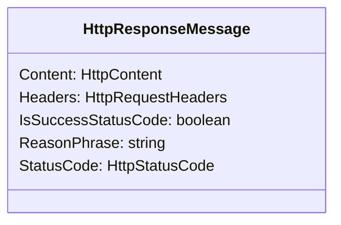

# `HttpResponseMessage`

表示包括状态代码和数据的 HTTP 响应消息

## 主要属性

### `Content`

[`HttpContent`](System.Net.Http.HttpContent)

HTTP消息的内容

#### 子属性/方法

- `Headers: HttpContentHeaders` HTTP内容标头
- `ReadAsStream(): System.IO.Stream` 将HTTP内容序列化并返回表示内容的流
- `ReadAsStringAsync(): System.Threading.Tasks.Task<string>` 将HTTP内容序列化到字符串，此为异步操作

### `Headers`

`HttpResponseHeaders`

HTTP内容标头

### `IsSuccessStatusCode`

`boolean`

HTTP响应是否成功

### `ReasonPhrase`

`string`

服务器发送的原因短语

### `StatusCode`

[`HttpStatusCode`枚举](https://learn.microsoft.com/zh-cn/dotnet/api/system.net.httpstatuscode)

HTTP响应的状态代码
