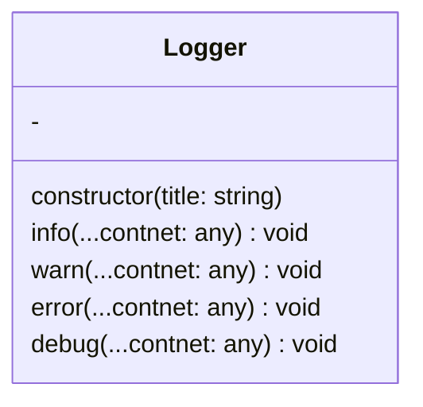

# 📢 Logger

一个简简单单的Logger



## 示例

```js
const logger = new Logger("Example");
logger.info("这是一条信息输出");
logger.warn("这是一条警告输出");
logger.error("这是一条错误输出");
logger.debug("这是一条信息输出");
```


## 构造函数

- `Logger(title: string)`
  - Logger名称

## 函数

- `info(...content: any): void`
  - 输出一条普通消息
- `warn(...content: any): void`
  - 输出一条警告消息
- `error(...content: any): void`
  - 输出一条错误消息
- `debug(...content: any): void`
  - 输出一条调试消息
  - 此消息将输出到Serein的debug窗口而不是插件控制台

:::tip
以上四个函数可以有多个参数，输出时各参数将用空格连接
:::
