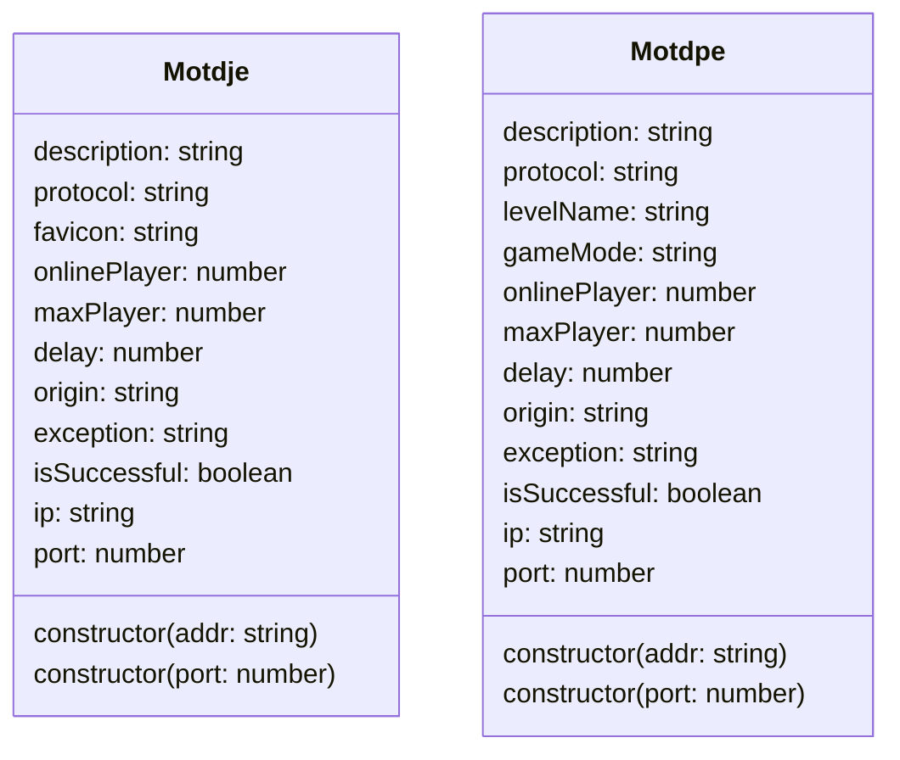

# 🎮 Motdje/Motdpe

~~Jvav~~版和基岩版的Motd对象



```js
let motd1 = new Motdje('1.2.3.4:1234'); // 地址（支持域名解析和带端口的文本解析）
let motd2 = new Motdje(1234); // 本地端口
```

## 属性

```ts showLineNumbers
/**
 * Java服务器Motd对象
 */
declare class Motdje {
    /**
     * Java服务器Motd对象
     * @param {string} addr 服务器地址
     */
    constructor(addr: string)

    /**
     * Java服务器Motd对象
     * @param {number} port 本地端口
     */
    constructor(port: number)

    /**
     * 最大玩家数
     */
    readonly maxPlayer: number;

    /**
     * 在线玩家数
     */
    readonly onlinePlayer: number;

    /**
     * 服务器描述
     */
    readonly description: string;

    /**
     * 协议
     */
    readonly protocol: string;

    /**
     * 图标（CQ码）
     */
    readonly favicon: string;

    /**
     * 延迟（ms）
     */
    readonly delay: number;

    /**
     * 原文
     */
    readonly origin: string;

    /**
     * 错误消息
     */
    readonly exception: string;

    /**
     * 是否获取成功
     */
    readonly isSuccessful: boolean;

    /**
     * IP
     */
    readonly ip: string;

    /**
     * 端口
     */
    readonly port: number;
}

/**
 * 基岩版服务器Motd对象
 */
declare class Motdpe {

    /**
     * 基岩版服务器Motd对象
     * @param {string} addr 服务器地址
     */
    constructor(addr: string)

    /**
     * 基岩版服务器Motd对象
     * @param {number} port 本地端口
     */
    constructor(port: number)

    /**
     * 最大玩家数
     */
    readonly maxPlayer: number;

    /**
     * 在线玩家数
     */
    readonly onlinePlayer: number;

    /**
     * 服务器描述
     */
    readonly description: string;

    /**
     * 协议
     */
    readonly protocol: string;

    /**
     * 存档名称
     */
    readonly levelName: string;

    /**
     * 游戏模式
     */
    readonly gameMode: string;

    /**
     * 延迟（ms）
     */
    readonly delay: number;

    /**
     * 原文
     */
    readonly origin: string;

    /**
     * 错误消息
     */
    readonly exception: string;

    /**
     * 是否获取成功
     */
    readonly isSuccessful: boolean;

    /**
     * IP
     */
    readonly ip: string;

    /**
     * 端口
     */
    readonly port: number;
}
```
