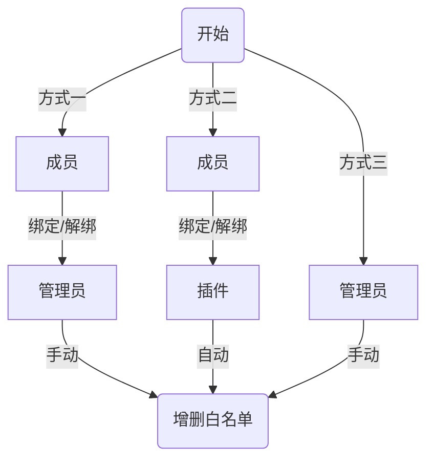

更完善的白名单管理方案，基于 Serein 成员管理，需禁用白名单相关正则

<!--truncate-->

## 功能&特征

:::tip
下列功能可以通过配置文件控制是否启用
:::

-   群成员使用群命令 **绑定/解绑** 管理自己的成员管理，可自动修改群名片
-   完善的绑定增删逻辑以及各种全面的防呆设计
-   服务器启动自动同步 **Serein 成员管理** 与 **服务器白名单**，关服时也能绑定
-   将 **成员管理** 设为 **服务器白名单** 后，无白名单玩家进服会在群聊提醒”没有白名单，尝试进入服务器“

<details>
	<summary>点此以查看示例图片</summary>


</details>

-   Serein 管理权限列表的管理使用群命令 **添加/删除白名单** 管理其他人的 **成员管理**
-   自动删除退群成员的 **成员管理** 与 **白名单** 数据
-   通过群命令“白名单列表”查看当前所有白名单情况

<details>
	<summary>点此以查看示例图片</summary>


</details>

-   在绑定时检测 GameID 是否符合规范
-   排除监听指定群聊，可以单独开个服务器玩家群用于管理玩家
-   在多服装了 n 个插件后，可以关闭 n-1 个服务器的信息回复防止发送重复信息

## 管理流程

:::tip
方式一适合需要经过审核再添加白名单的服务器  
方式二适合玩家进群后可以直接添加白名单的服务器  
方式三作为备用方案一直存在，使用方式一或方式二可以通过配置文件更改
:::



---

## 使用方法

:::tip
在 `v1.8` 版本后，命令关键词可以通过配置文件自定义
:::

| 群成员命令    | 描述                                                       | 其他关键词 |
| ------------- | ---------------------------------------------------------- | ---------- |
| `绑定 GameID` | 使自己 QQ 与游戏 id 绑定，并获得白名单（可选择是否开启）   | bind       |
| `解绑`        | 使自己 QQ 与已绑定 id 解绑，并删除白名单（可选择是否开启） | unbind     |

| 管理员命令                          | 描述                                       | 其他关键词             |
| ----------------------------------- | ------------------------------------------ | ---------------------- |
| `添加白名单 <QQ号(@成员)> <GameID>` | 使该 QQ 与游戏 id 绑定，并获得白名单       | wladd、whitelistadd    |
| `删除白名单 <QQ号(@成员)> GameID>`  | 使该 QQ 与已绑定 id 解绑，并删除白名单     | wldel、whitelistdelete |
| `同步白名单`                        | 以 Serein 成员管理为准，自动同步所有白名单 | syncwl、syncwhitelist  |
| `同步白名单 <QQ号(@成员)>`          | 使该成员的绑定 id 同步白名单               | syncwl、syncwhitelist  |
| `白名单列表`                        | 列出 Serein 成员管理列表等信息             | wllist、whitelist      |

---

## 配置文件

:::tip
更新版本后需要重新修改配置文件
:::

```json
{
	"NOTICE": "https://market.serein.cc/resources/BetterWhitelistt#配置文件",
	"version": "v1.8",
	"hasBind": true, // 群成员使用绑定/解绑命令的权限
	"exitGroup": true, // 自动删除退群成员的 serein 成员管理数据
	"editCard": true, // 自动修改群成员的群名片为 GameID，需管理员权限
	"onlineMode": true, // 添加白名单时检测 GameID 是否符合规范
	"sendGroup": true, // 向群聊中发送信息，关闭后可防止多服发送重复信息
	"syncWhitelist": true, // 自动同步 serein 成员管理与服务端白名单
	"betterMembers": {
		"enable": false, // 将 serein 成员管理设为白名单
		"interServer": [
			// 匹配玩家进入服务器的控制台信息
			"^.*?Player Spawned: (.*?) xuid:.*$",
			"^.*?Player connected: (.*?), xuid:.*$"
		],
		"interServerReply": "^.*?Kicked (.*?) .*You do not have a whitelist!.*$"
	},
	"command": {
		"bind": {
			"name": "绑定",
			"keywords": [
				// 群内响应关键词，可自行增删
				"绑定",
				"bind"
			]
		},
		"unbind": {
			"name": "解绑",
			"keywords": ["解绑", "unbind"]
		},
		"whitelistAdd": {
			"name": "添加白名单",
			"keywords": ["添加白名单", "whitelistadd", "wladd"]
		},
		"whitelistDelete": {
			"name": "删除白名单",
			"keywords": ["删除白名单", "whitelistdelete", "wldel"]
		},
		"syncWhitelist": {
			"name": "同步白名单",
			"keywords": ["同步白名单", "whitelistsync", "wlsync"]
		},
		"whitelist": {
			"name": "白名单列表",
			"keywords": ["白名单列表", "whitelist", "wllist"]
		}
	}
}
```

## 历史版本

:::caution
`v1.8` 后此插件最低支持版本为 Serein `v1.3.4.1`，在 `v1.3.4` 及以下版本几乎不可用
:::

-   2023.5.9 [v1.8](https://download.serein.cc/https://raw.githubusercontent.com/Zaitonn/Serein-Docs/b22810e487103cf9d990b96ef70b9ccf2b9f042e/JS/BetterWhitelist/BetterWhitelist.js?download)
-   2023.4.1 [v1.6](https://download.serein.cc/https://raw.githubusercontent.com/Zaitonn/Serein-Docs/5bf23e0c3666087a1faca1ada4064781b9d50c20/JS/BetterWhitelist/v1.6/BetterWhitelist.js?download)
-   2023.2.26 [v1.4](https://download.serein.cc/https://raw.githubusercontent.com/Zaitonn/Serein-Docs/5bf23e0c3666087a1faca1ada4064781b9d50c20/JS/BetterWhitelist/v1.4/BetterWhitelist.js?download)
-   2023.2.3 [v1.3](https://download.serein.cc/https://raw.githubusercontent.com/Zaitonn/Serein-Docs/5bf23e0c3666087a1faca1ada4064781b9d50c20/JS/BetterWhitelist/v1.3/BetterWhitelist.js?download)
-   2023.2.3 [v1.2](https://download.serein.cc/https://raw.githubusercontent.com/Zaitonn/Serein-Docs/5bf23e0c3666087a1faca1ada4064781b9d50c20/JS/BetterWhitelist/v1.2/BetterWhitelist.js?download)
-   2023.1.18 [v1.1](https://download.serein.cc/https://raw.githubusercontent.com/Zaitonn/Serein-Docs/5bf23e0c3666087a1faca1ada4064781b9d50c20/JS/BetterWhitelist/v1.1/BetterWhitelist.js?download)
-   2023.1.18 [v1.0](https://download.serein.cc/https://raw.githubusercontent.com/Zaitonn/Serein-Docs/5bf23e0c3666087a1faca1ada4064781b9d50c20/JS/BetterWhitelist/v1.0/BetterWhitelist.js?download)
