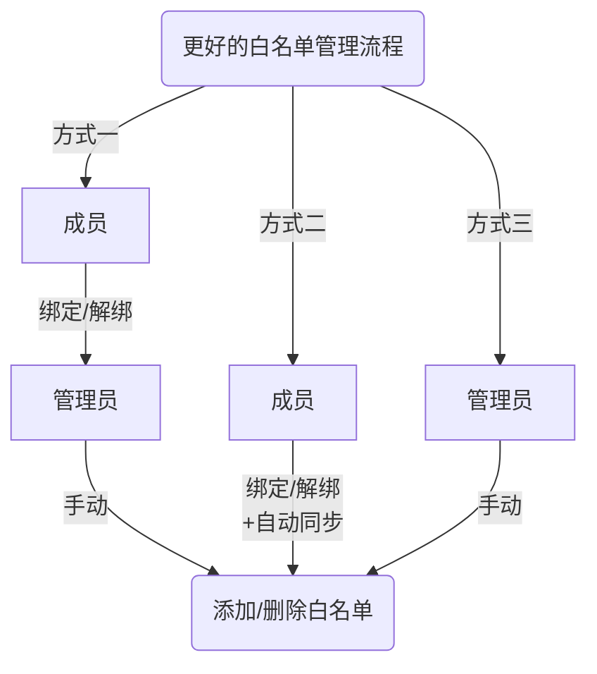

更完善的白名单管理方案，基于 Serein 成员管理，需禁用白名单相关正则

<!--truncate-->

:::caution
此插件最低支持版本为 Serein `v1.3.4`  
在 `v1.3.3` 及以下版本 解绑 返回值有误
:::

## 流程图

使用方式一还是方式二可通过配置文件更改，方式三一直存在

## 功能

- 群成员使用群命令 **绑定/解绑自己的成员管理**
- 手动、自动 **同步 Serein 的成员管理 与 服务器白名单**，关服时也能绑定
- **将 Serein 成员管理设为服务器白名单**，使用 llbds 且关闭 bds 白名单可开启
- 自动删除退群成员的 serein 成员管理数据与白名单
- 绑定时自动修改群成员的群名片，需管理员权限
- 监测服务器启动自动同步白名单，关服也能增删白名单
- 排除监听指定群聊，可以单独开个服务器玩家群用于管理玩家
- Serein 管理权限列表的管理使用群命令 **添加/删除其他人的成员管理**
- ...

## 使用方法

| 群成员命令    | 说明                                                       | 其他关键词 |
| ------------- | ---------------------------------------------------------- | ---------- |
| `绑定 GameID` | 使自己 QQ 与游戏 id 绑定，并获得白名单（可选择是否开启）   | bind       |
| `解绑`        | 使自己 QQ 与已绑定 id 解绑，并删除白名单（可选择是否开启） | unbind     |

| 管理员命令                          | 说明                                       | 其他关键词             |
| ----------------------------------- | ------------------------------------------ | ---------------------- |
| `添加白名单 <QQ号(@成员)> <GameID>` | 使该 QQ 与游戏 id 绑定，并获得白名单       | wladd、whitelistadd    |
| `删除白名单 <QQ号(@成员)> GameID>`  | 使该 QQ 与已绑定 id 解绑，并删除白名单     | wldel、whitelistdelete |
| `同步白名单`                        | 以 Serein 成员管理为准，自动同步所有白名单 | syncwl、syncwhitelist  |
| `同步白名单 <QQ号(@成员)>`          | 使该成员的绑定 id 同步白名单               | syncwl、syncwhitelist  |
| `白名单列表`                        | 列出 Serein 成员管理列表等信息             | wllist、whitelist      |

## 特征

- 完善的白名单增删逻辑

- 各种防呆设计

## 配置文件

## 历史版本

- 2023.4.1 [v1.6](https://download.serein.cc/https://raw.githubusercontent.com/Zaitonn/Serein-Docs/5bf23e0c3666087a1faca1ada4064781b9d50c20/JS/BetterWhitelist/v1.6/BetterWhitelist.js?download)
- 2023.2.26 [v1.4](https://download.serein.cc/https://raw.githubusercontent.com/Zaitonn/Serein-Docs/5bf23e0c3666087a1faca1ada4064781b9d50c20/JS/BetterWhitelist/v1.4/BetterWhitelist.js?download)
- 2023.2.3 [v1.3](https://download.serein.cc/https://raw.githubusercontent.com/Zaitonn/Serein-Docs/5bf23e0c3666087a1faca1ada4064781b9d50c20/JS/BetterWhitelist/v1.3/BetterWhitelist.js?download)
- 2023.2.3 [v1.2](https://download.serein.cc/https://raw.githubusercontent.com/Zaitonn/Serein-Docs/5bf23e0c3666087a1faca1ada4064781b9d50c20/JS/BetterWhitelist/v1.2/BetterWhitelist.js?download)
- 2023.1.18 [v1.1](https://download.serein.cc/https://raw.githubusercontent.com/Zaitonn/Serein-Docs/5bf23e0c3666087a1faca1ada4064781b9d50c20/JS/BetterWhitelist/v1.1/BetterWhitelist.js?download)
- 2023.1.18 [v1.0](https://download.serein.cc/https://raw.githubusercontent.com/Zaitonn/Serein-Docs/5bf23e0c3666087a1faca1ada4064781b9d50c20/JS/BetterWhitelist/v1.0/BetterWhitelist.js?download)
