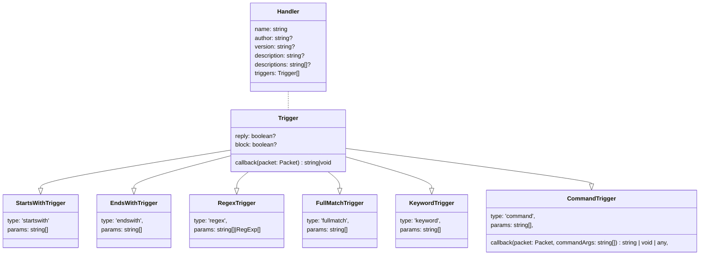

<p style={{
  textAlign: 'center',
  display:'flex',
  justifyContent: 'center',
  alignItems: 'center'}}>


<span
  style={{fontSize:'30px',fontWeight:'bolder'}}>
MsgHelper

</span>
<span
  style={{fontSize:'15px',fontWeight:'bolder',margin:'10px',opacity:'0.3'}}>
原CommandHelper

</span>
</p>

---


- 提供快捷的命令注册功能
  - 支持填写插件介绍
  - 限定权限
  - 多个触发关键词
- 支持输出帮助菜单
  - 默认注册关键词为`help`和`帮助`

<!--truncate-->

## 安装方法

1. 下载[`MsgHelper.js`](#历史版本)后放到`plugins`文件夹下
2. 将其他插件放在同目录下

## 开发

1. 下载[模板和自动补全](#历史版本)两个文件后放到`plugins`文件夹下
2. 打开编辑`function callback()`和命令介绍
3. 重新加载插件

### 各类型之间继承关系



:::info

- Handler的`description`和`descriptions`都是这个消息处理器的介绍
  - `description` 为文本
  - `descriptions` 为字符串数组（一行一条）
  - 二者不允许同时设置
  - 注册后`descriptions`将被转成`description`
- `StartsWithTrigger`为匹配开头
- `EndsWithTrigger`为匹配结尾
- `RegexTrigger`采用正则匹配(`RegExp.test()`)
  - `params`为字符串和正则的数组，允许二者同时存在
    - 注册时字符串会转为正则
- `FullMatchTrigger`为完全匹配
- `KeywordTrigger`为关键词匹配
  - 只要该消息中含有`params`中的字符串就会触发
- `CommandTrigger`为命令匹配
  - 需要以config中的`commandPrefix`开头
  - `commandArgs`为使用`commandSeparator`分割得到的字符串组

:::

### 注册函数

```ts
declare type regHandler = (config: Handler) => boolean;

/** @type {regHandler} */
const MHregHandler = serein.imports('MsgHelper.regHandler');
MHregHandler(...);
```

:::tip
你可以参考以下插件

- [一言](OneWord)
- [随机涩图](setu)
- [随机草图](meme)
:::

## 历史版本

- 2023.6.8 v2.0
  - [`MsgHelper.js` - 本体](https://download.serein.cc/https://raw.githubusercontent.com/Zaitonn/Serein-Docs/4d3c4d6009685806b2f95cfa0851b35e28f5a330/JS/MsgHelper/MsgHelper.js?d)
  - [`template.js` - 模板](https://download.serein.cc/https://raw.githubusercontent.com/Zaitonn/Serein-Docs/4d3c4d6009685806b2f95cfa0851b35e28f5a330/JS/MsgHelper/template.js?d)
  - [`MsgHelper.ts` - 源码](https://download.serein.cc/https://raw.githubusercontent.com/Zaitonn/Serein-Docs/4d3c4d6009685806b2f95cfa0851b35e28f5a330/JS/MsgHelper/MsgHelper.ts?d)
  - [`MsgHelper.d.ts` - 自动补全](https://download.serein.cc/https://raw.githubusercontent.com/Zaitonn/Serein-Docs/4d3c4d6009685806b2f95cfa0851b35e28f5a330/JS/MsgHelper/MsgHelper.d.ts?d)
- 2023.4.19 v1.0
  - [`CommandHelper.js` - 本体](https://download.serein.cc/https://raw.githubusercontent.com/Zaitonn/Serein-Docs/5bf23e0c3666087a1faca1ada4064781b9d50c20/JS/CommandHelper/v1.0/CommandHelper.js?download)
  - [`template.js` - 模板](https://download.serein.cc/https://raw.githubusercontent.com/Zaitonn/Serein-Docs/5bf23e0c3666087a1faca1ada4064781b9d50c20/JS/CommandHelper/v1.0/template.js?download)
  - [`CommandHelper.d.ts` - 自动补全](https://download.serein.cc/https://raw.githubusercontent.com/Zaitonn/Serein-Docs/5bf23e0c3666087a1faca1ada4064781b9d50c20/JS/CommandHelper/v1.0/CommandHelper.d.ts?download)
