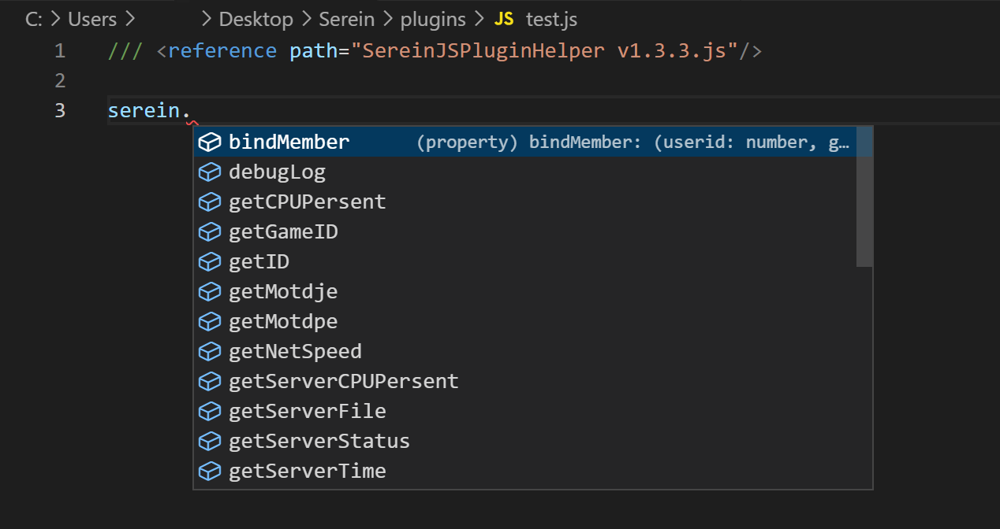

提供代码片段补全等功能

<!--truncate-->



## 使用方法

- 建议使用 Visual Studio Code 编写插件 下载：<https://code.visualstudio.com/>

1. 将此文件复制到插件的同文件夹下

2. 在你的插件第一行加上下面这一行

    ```js
    /// <reference path="SereinJSPluginHelper.js"/>
    ```

3. 然后你就可以快乐地写插件了，这时候就可以自动补全和显示函数参数了！！

>[!TIP]发布时**不需要**带上此插件

## 历史版本

- 2023.2.25 [v1.3.4](https://download.serein.cc/https://raw.githubusercontent.com/Zaitonn/Serein-Docs/publish/JS/SereinJSPluginHelper/v1.3.4/SereinJSPluginHelper.js)
- 2023.1.15 [v1.3.3](https://download.serein.cc/https://raw.githubusercontent.com/Zaitonn/Serein-Docs/publish/JS/SereinJSPluginHelper/v1.3.3/SereinJSPluginHelper.js)
