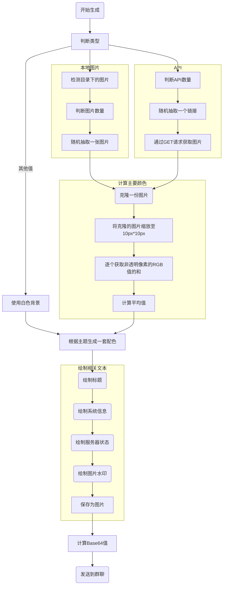

生成当前系统和服务器状态的图片，支持自定义标题和图片/API


<!--truncate-->

:::caution

- 此插件支持的最低版本为v1.3.4.2
- 你需要安装
  - [文件读写模块](stdio)
    - 下载后放在plugins/modules文件夹内
  - [消息助手](MsgHelper)
    - 下载后放在plugins文件夹内
- 此插件使用了Typescript编写，阅读编译后的JS文件可能会有一些困难

:::

## 显示内容

- 系统信息
  - CPU占用率
  - CPU名称
  - 内存使用率
  - 内存大小
  - 系统名称
  - 网速
- 服务器
  - 状态
  - 人数
  - 类型
  - 版本

## 使用方法

1. 安装前置插件  
  [文件读写模块](stdio)、[消息助手](MsgHelper)
2. 加载插件
3. 按照提示重新加载
4. 在监听的群聊中发送以下任意值触发
   - zt
   - 状态
   - 服务器状态

## 逻辑

<details>
	<summary>点此以查看流程图</summary>



</details>

## 配置文件

```json
{
  "urls": [
    "https://t.mwm.moe/ysmp/",
    "https://t.mwm.moe/mp/",
    "https://t.mwm.moe/moemp/"
  ],
  "originType": "api",
  "title": "Serein · 状态",
  "font": "得意黑",
  "shadow": true,
  "theme": "auto",
  "defaultColor": ""
}
```

### `urls`

`string[]`

指定获取图片的API

:::note
仅当`originType`为'api'时生效
:::

### `originType`

`'local' | 'api'`

图片来源类型

- `local`
  - 本地图片
    - 将从plugins/StatPictureGenerater文件夹下随机抽取一张图片
    - 可用的文件扩展名为`.png`、`.jpg`、`.jpeg`、`.bmp`
- `api`
  - 使用[`urls`](#urls)中的链接获取
    - 请务必确保返回的是图片而不是json文本或者链接

:::tip

- 推荐使用竖屏（4:3）图片
  - 若比例或大小不满足将自动裁剪
    - 左上角对齐

:::

### `title`

`string?`

图片的标题

为空时则保持默认值`Serein · 状态`


### `font`

`string`

生成图片使用的字体

### `shadow`

`boolean`

是否显示文字和占用饼图的阴影

### `theme`

`'dark' | 'light' | 'auto'`

图片的文字和背景的主题

- `dark`
  - 深色主题  
  
- `light`
  - 浅色主题  
  
- `auto`或其他异常值
  - 根据图片的主要颜色自动判断

### `defaultColor`

`string`

默认主题颜色

- 为空时自动从图片的主要颜色计算而得
- 格式
  - `#RGB`
  - `#RRGGBB`
  - `#RRGGBBAA`
  - 其他格式或不合法将被视作透明

## 历史版本

- 2023.6.7 v1.1
  - [**`StatPictureGenerater.js`**](https://download.serein.cc/https://raw.githubusercontent.com/Zaitonn/Serein-Docs/4d3c4d6009685806b2f95cfa0851b35e28f5a330/JS/StatPictureGenerater/StatPictureGenerater.js?d) 编译后的文件
  - [`StatPictureGenerater.ts`](https://download.serein.cc/https://raw.githubusercontent.com/Zaitonn/Serein-Docs/4d3c4d6009685806b2f95cfa0851b35e28f5a330/JS/StatPictureGenerater/StatPictureGenerater.ts?d) TypeScript源码
- 2023.5.31 v1.0
  - [`StatPictureGenerater.js`](https://download.serein.cc/https://raw.githubusercontent.com/Zaitonn/Serein-Docs/45ae3bbe50561e590ba6eb090fd6e58fc4b704b4/JS/StatPictureGenerater/StatPictureGenerater.js?d) 编译后的文件
  - [`StatPictureGenerater.ts`](https://download.serein.cc/https://raw.githubusercontent.com/Zaitonn/Serein-Docs/45ae3bbe50561e590ba6eb090fd6e58fc4b704b4/JS/StatPictureGenerater/StatPictureGenerater.ts?d) TypeScript源码
